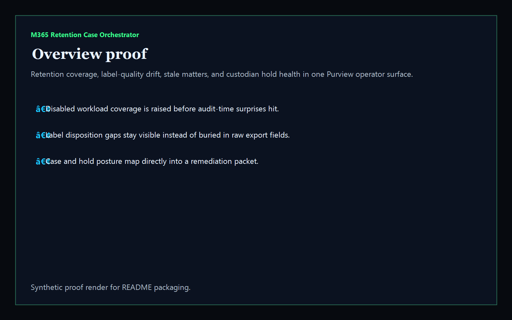
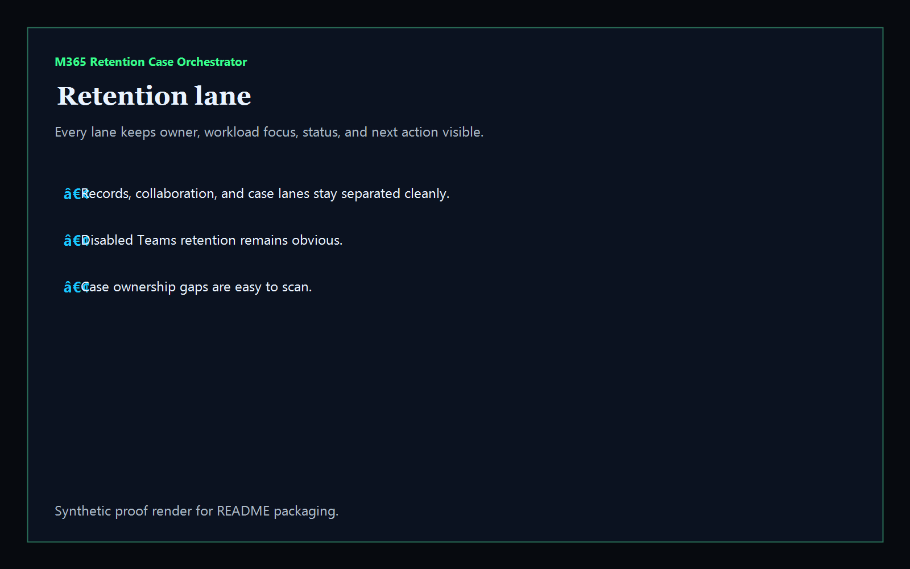
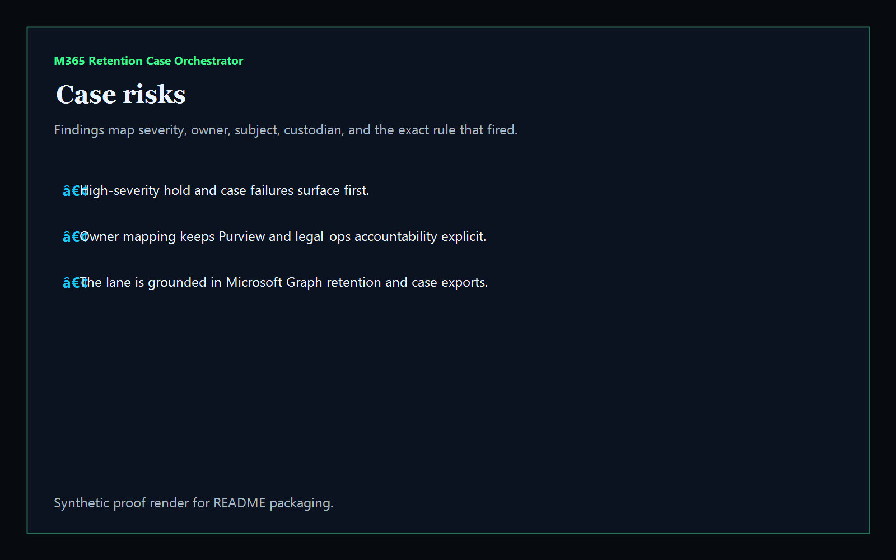
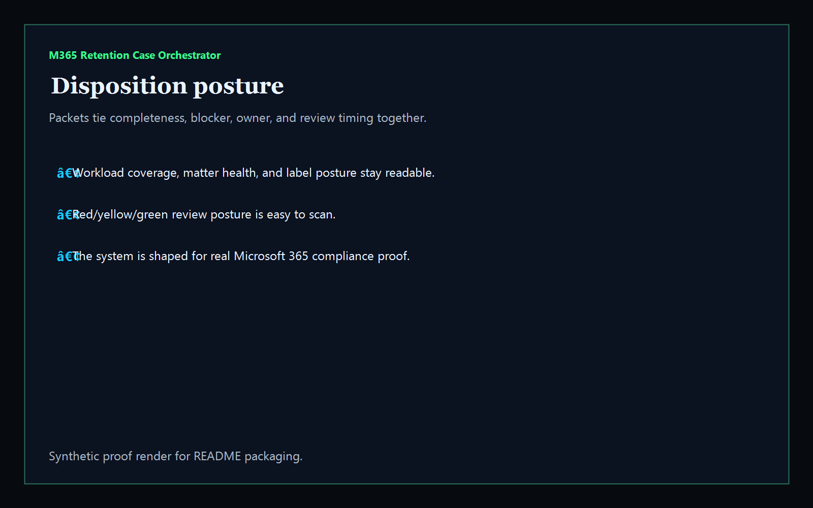

# m365-retention-case-orchestrator

[](https://github.com/mizcausevic-dev/m365-retention-case-orchestrator/actions/workflows/ci.yml)
[](./LICENSE)
[](https://github.com/mizcausevic-dev/m365-retention-case-orchestrator/actions/workflows/pages.yml)

Operator control plane for Microsoft 365 Purview retention policies, label disposition quality, eDiscovery case posture, custodian hold health, and remediation sequencing.

## Why this exists

- Purview exports become dangerous when they stay trapped in raw JSON instead of one operator-readable surface.
- Retention, label, and eDiscovery posture need to be visible together before audits, investigations, or disposition events drift.
- Recruiters looking for `Azure / Microsoft 365 / Purview / eDiscovery` proof should see a real compliance-and-legal-ops dashboard, not a keyword page.
- This repo turns Microsoft Graph compliance exports into a control plane for retention coverage, stale cases, failed holds, and disposition readiness.

## Why this matters (KG Embedded tie-back)

This repo demonstrates the Purview compliance-control primitive for Microsoft tenant operations: retention coverage, disposition gaps, custodian hold health, and matter-readiness packets in one operator surface. Kinetic Gain Embedded extends this pattern into productized in-app dashboards where legal, compliance, and security teams need evidence-rich surfaces without exposing raw admin consoles or tenant data. See [kineticgain.com/embedded](https://kineticgain.com/embedded).

## What it shows

- retention-lane visibility for workloads, labels, policies, and case status in one dashboard
- case-risk detection for uncovered workloads, missing custodians, failed holds, stale matters, and broken disposition settings
- remediation packets for finance retention, marketing labels, vendor holds, and case reconciliation
- offline-safe analysis of captured Microsoft Graph retention and eDiscovery exports
- recruiter-facing Microsoft 365 / Purview / legal-ops proof that composes with Entra and Intune governance

## Routes

- `/`
- `/retention-lane`
- `/case-risks`
- `/disposition-posture`
- `/verification`
- `/docs`

## API

- `/api/dashboard/summary`
- `/api/retention-lane`
- `/api/case-risks`
- `/api/disposition-posture`
- `/api/verification`
- `/api/sample`

## Screenshots






## CLI

```powershell
npx m365-retention-case fixtures/compliance.json `
    --format json|markdown|summary `
    --now 2026-05-27T08:00:00Z `
    --stale-case-after-days 90 `
    --required-workloads Exchange,SharePoint,OneDrive,Teams `
    --fail-on-high `
    --out report.md
```

Input shape:

```json
{
  "retentionLabels": [ ... ],
  "retentionPolicies": [ ... ],
  "cases": [ ... ]
}
```

## Local Development

```powershell
cd m365-retention-case-orchestrator
npm install
npm run dev
```

Open:
- [http://127.0.0.1:5513/](http://127.0.0.1:5513/)
- [http://127.0.0.1:5513/retention-lane](http://127.0.0.1:5513/retention-lane)
- [http://127.0.0.1:5513/case-risks](http://127.0.0.1:5513/case-risks)
- [http://127.0.0.1:5513/disposition-posture](http://127.0.0.1:5513/disposition-posture)
- [http://127.0.0.1:5513/verification](http://127.0.0.1:5513/verification)

## Validation

- `npm run lint`
- `npm run typecheck`
- `npm run coverage`
- `npm run build`
- `npm run demo`
- `npm run smoke`
- `npm run prerender`
- `npm run render:assets`

## Production status

| Aspect | Status |
|--------|--------|
| CI | Node 20 + 22 matrix — lint · typecheck · coverage · build · demo · smoke · prerender · `npm audit` |
| License | [AGPL-3.0-or-later](./LICENSE) |
| Deploy | Static prerender -> **https://retention.kineticgain.com/** |
| Data posture | Synthetic sample data only; no live tenant exports, Graph tokens, or Purview admin credentials |

## Docs

- [Kinetic Gain Embedded tie-back](./docs/KINETIC_GAIN_EMBEDDED.md)
- [Changelog](./CHANGELOG.md)

## Composes with

- [**`entra-access-review-control-plane`**](https://github.com/mizcausevic-dev/entra-access-review-control-plane) — Microsoft Entra access reviews
- [**`intune-device-compliance-ops`**](https://github.com/mizcausevic-dev/intune-device-compliance-ops) — Intune device compliance

Together they form the recruiter-facing Microsoft admin lane: Entra governance, Intune fleet posture, and Purview retention / eDiscovery operations.
